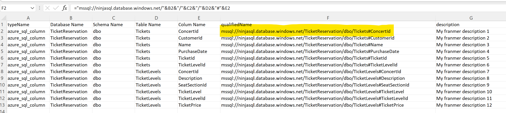
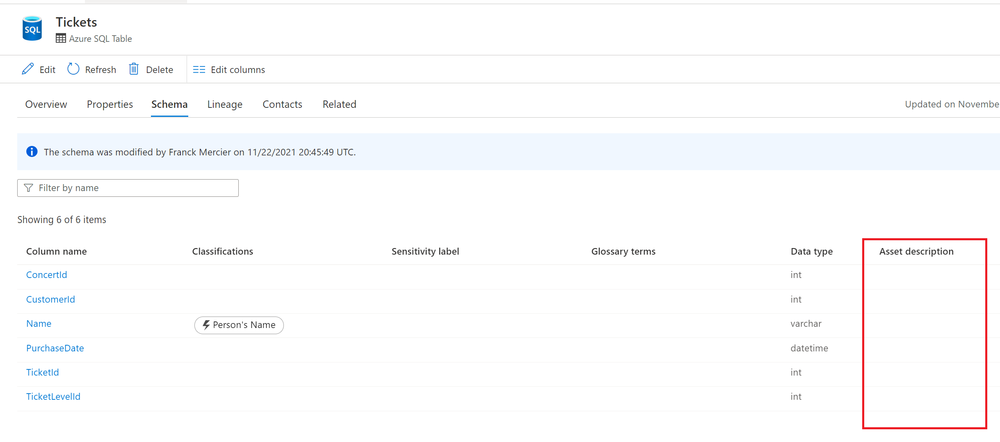
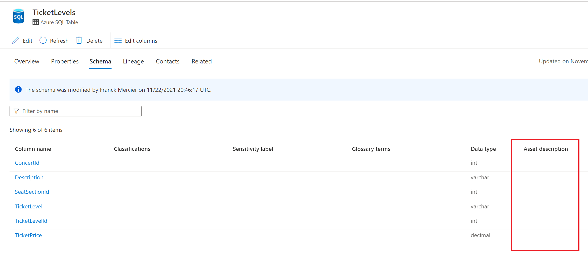

A request that comes up from time to time with Azure Purview, is the ability to update asset properties from an existing one such as an Excel file.

In this article, I will illustrate a possible way to meet this need using Azure Purview APIs. By the way, thanks to [Will Johnson](https://github.com/wjohnson) for your help!

## Scenario description

Here we have an Excel file that contains the descriptions of the columns of our SQL tables. You will notice that the value of the column **"qualifiedName"** is the result of a formula. This may matter, later, in python code.

On the Azure Purview side, the scans have been done and we have the corresponding assets.

Below is an example with 2 assets. The goal is to automatically update the **"Asset description"** field for the 2 assets:

## Prerequisites

In order to run the script, it will be necessary:

- Register an [application in Azure Active Directory (AAD)](https://docs.microsoft.com/en-us/azure/active-directory/develop/quickstart-register-app)
- Add this application as a **"Data Curator"** at the collection level **"Root"**. More details [here](https://docs.microsoft.com/en-us/azure/purview/catalog-permissions)
- Visual Studio Code (or another code editor)

