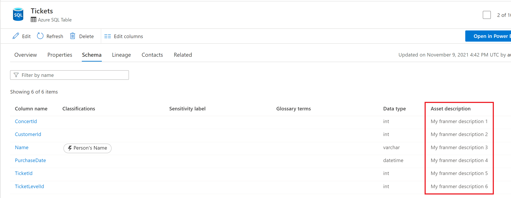
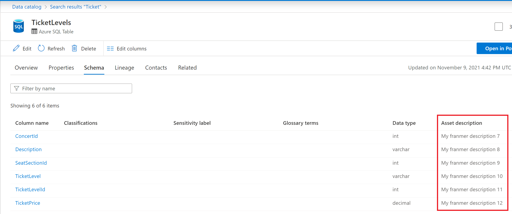

A request that comes up from time to time with Azure Purview, is the ability to update asset properties from an existing one such as an Excel file.

In this article, I will illustrate a possible way to meet this need using Azure Purview APIs. By the way, thanks to [Will Johnson](https://github.com/wjohnson) for your help!

## Scenario description

Here we have an Excel file that contains the descriptions of the columns of our SQL tables. You will notice that the value of the column **"qualifiedName"** is the result of a formula. This may matter, later, in python code.


On the Azure Purview side, the scans have been done and we have the corresponding assets.

Below is an example with 2 assets. The goal is to automatically update the **"Asset description"** field for the 2 assets:


## Prerequisites

In order to run the script, it will be necessary:

- Register an [application in Azure Active Directory (AAD)](https://docs.microsoft.com/en-us/azure/active-directory/develop/quickstart-register-app)
- Add this application as a **"Data Curator"** at the collection level **"Root"**. More details [here](https://docs.microsoft.com/en-us/azure/purview/catalog-permissions)
- Visual Studio Code (or another code editor)


## The script

In my example, the Excel file is on my local hard disk: "C:\Temp\Purview\Excel\ColumnDesc_Rich.xlsx".

As explained above, my Excel file contains a column whose result comes from a calculation formula. If you only want to retrieve the value of the cell, not the formula, you must use the argument **"data_only=True"**. Otherwise, without this argument, the formula itself will be returned.

Copy and paste the script below into your code editor. 
Complete the code with your Azure Purview account and AAD app information:


```Javascript
import openpyxl
from pyapacheatlas.readers import ExcelConfiguration, ExcelReader
import json
import os
from pyapacheatlas.auth import ServicePrincipalAuthentication
from pyapacheatlas.core import PurviewClient, AtlasEntity, AtlasProcess
from pyapacheatlas.core.util import GuidTracker
if __name__ == "__main__":
    purview_Account_Name = "<YourAzurePurviewAccountName>"
    oauth = ServicePrincipalAuthentication(
    client_id="<Your Client ID>",
    tenant_id="<Your Tenant ID>",    
    client_secret="<Your Secret>"
    )
    client = PurviewClient(
        account_name=purview_Account_Name,
        authentication=oauth
    )
ec = ExcelConfiguration() 
reader = ExcelReader(ec)
wb = openpyxl.load_workbook('C:\Temp\Purview\Excel\ColumnDesc_Rich.xlsx',data_only=True)
sheet = wb['Sheet1']
rows = reader._parse_spreadsheet(sheet)
for row in rows:
    client.partial_update_entity(
        typeName=row["typeName"],
        qualifiedName=row["qualifiedName"],
        attributes={
            "description":row["description"]
        }
    )
```

After running the script, you should have your Azure Purview assets updated with the values from the Excel file as shown below:






A video to showcase that script can be found [here](https://github.com/franmer2/BulkEdit_US/tree/main/Vid%C3%A9o)
